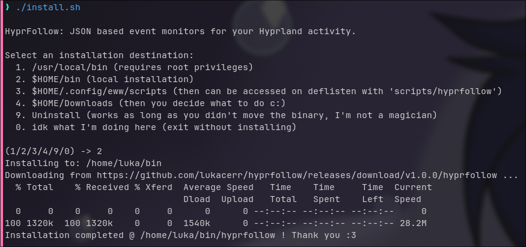
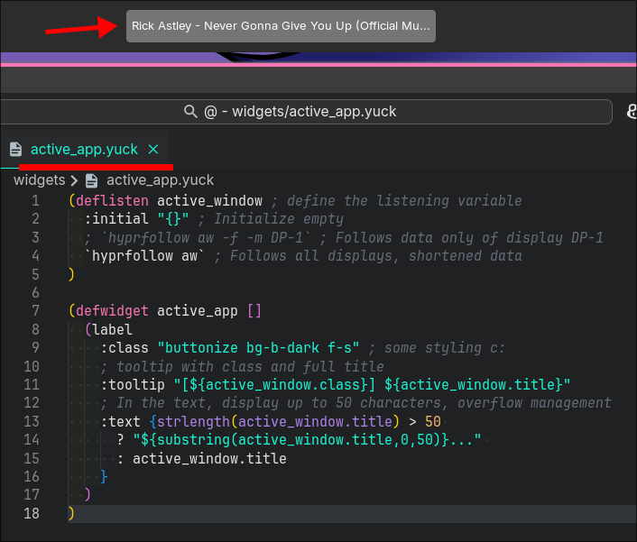
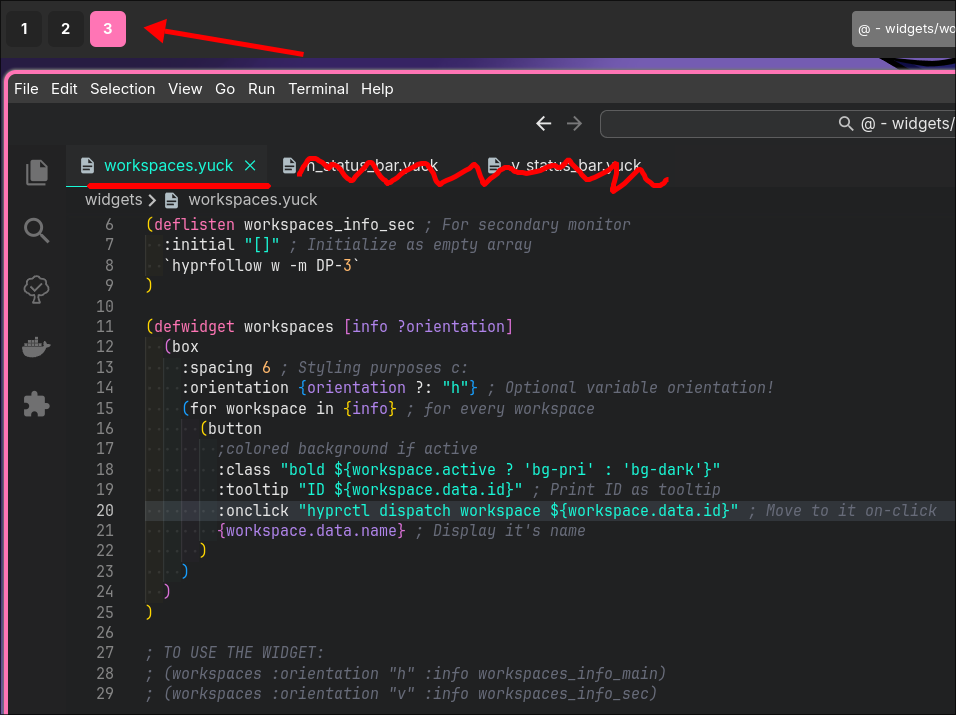
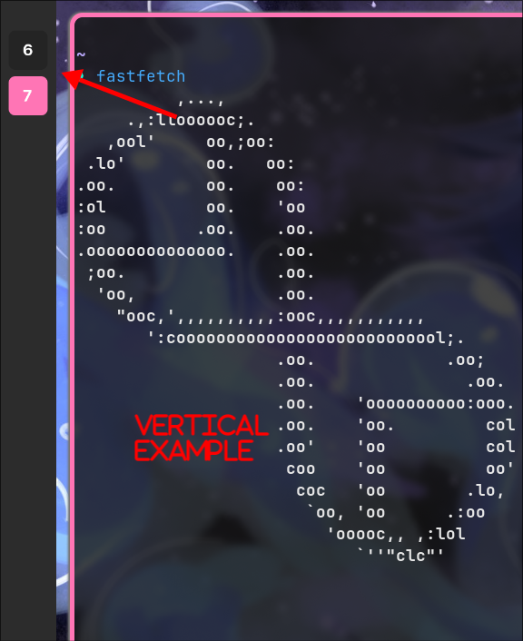

# HyprFollow

JSON based event monitors for your Hyprland activity.

## Why did I do this?

Mainly to use it with my eww config. Hyprland doesn't implement monitoring/event listening from their terminal utilities,
But it is possible to listen trough IPC bindings like the one used here, [hyprland-rs](https://github.com/hyprland-community/hyprland-rs).

### How to use?

> Output of `hyprfollow -h`

```text
HyprFollow: Monitor your Hyprland activity.

USAGE:
  hyprfollow [monitor] [options...]

FLAGS:
  -h, --help                    Displays this text

AVAILABLE MONITORS:
  aw, active-window             Monitors active window
  w, workspaces                 Monitors workspaces changes
  s, submap                     Monitors active submap changes

FLAGS FOR ALL MONITORS:
  -h, --help                    Displays list of options for the specified monitor

EXAMPLES:
  hyprfollow aw                 Starts monitoring active window state
  hyprfollow w -h               Lists options for the workspaces monitor

TIPS:
  Combine with jq for a readable output: hyprfollow [monitor] [options...] | jq .
  Concatenate more than one monitor with the '&' operator (ej 'hyprfollow s & hyprfollow w -m 3')

> May I help you?
@lukacerr in most social media :)
```

## Install / Uninstall

A script is provided for ease of use. Following example uses curl to run it:

```sh
curl --proto '=https' --tlsv1.2 -sSf https://raw.githubusercontent.com/lukacerr/hyprfollow/main/install.sh | sh
```

> Exmaple



_If unsure, go for option 2._

### [eww](https://github.com/elkowar/eww) integration examples

> Active window



> Workspace





#### Final notes

I'm new to rust. This is my first somewhat useful project.
Won't ask for any donations or stuff, but I'd really appreciate feedback & reviews.
Just willing to learn here.
If you got this far you may as well drink water. Now.
